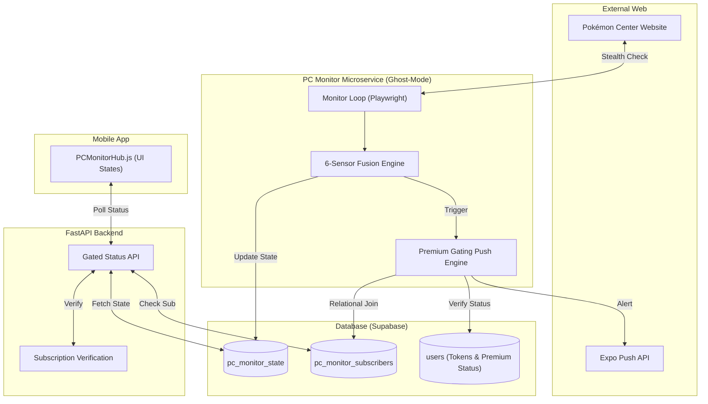
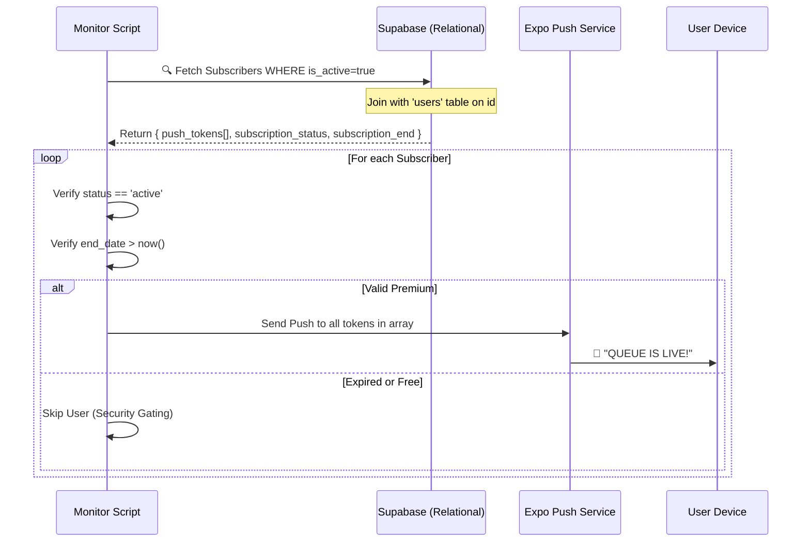

# HollowScan: Pokémon Center Elite Monitor 🛡️🔥
## End-to-End System Architecture & Specification

This document provides a comprehensive technical overview of the **HollowScan Pokémon Center Monitor**, a high-performance, stealth-focused microservice designed to bypass enterprise-grade WAFs (Imperva) and provide real-time intelligence to premium users.

---

## 1. High-Level Architecture

The system is composed of four primary layers working in perfect synchronization:

---

## 2. Working Mechanism: The "Ghost-Mode" Loop

Every 30-60 minutes (configurable), the monitor initiates a check. To remain undetected by **Imperva**, it follows a strict isolation protocol.

### Step A: Total Session Isolation
1.  **Browser Destruction**: The previous browser instance is completely killed. No cache, no cookies, no local storage persists.
2.  **Proxy Jump**: A new gateway is selected from the 100-node Webshare pool.
3.  **Fingerprint Randomization**: A unique User-Agent and viewport are assigned.

### Step B: Human Behavioral Simulation
To bypass behavioral analysis, the monitor does NOT just load the page. It mimics a human:
*   **Bezier Curves**: Mouse movements follow organic, non-linear paths.
*   **Gaussian Delays**: Wait times between actions are calculated using a normal distribution (no robotic "exactly 2 seconds" waits).
*   **Momentum Scrolling**: The bot scrolls up and down randomly to simulate reading.

### Step C: The 6-Sensor Detection Engine
The system doesn't just look for "Queue". it uses a confidence-based fusion of 6 independent sensors:

| Sensor | Description | Weight/Confidence |
| :--- | :--- | :--- |
| **Network Traffic** | Detects background calls to `queue-it.net`. | 100% (Instant Live) |
| **URL Redirect** | Detects `waitingroom` or `queue-it` in the address bar. | 100% (Instant Live) |
| **DOM Heuristics** | Scans for hidden `queue-it.js` or `Challenge_Banner` IDs. | 80% |
| **Cookie Fingerprint** | Detects the `QueueIT` cookie dropped by the WAF. | 60% |
| **Text Keywords** | Intelligent, case-insensitive scan (e.g., "Hi, Trainer!", "Virtual Queue"). | 40% |
| **Regex Timer** | Detects digital or text countdowns (e.g., `00:05:00`, `10 mins`). | 40% |

---

## 3. The Premium Gating Logic

We ensure that **Zero Alerts** are leaked to non-premium or expired users through a real-time Relational Join.

---

## 4. User Scenarios

### Scenario 1: The Free User
*   **Mobile App**: The `PCMonitorHub` sees the user is not premium. It displays a blurred "LOCKED" card with a padlock. 🔒
*   **API**: The FastAPI backend refuses to return any live data, returning `state: LOCKED`.
*   **Result**: The user is encouraged to upgrade but sees zero queue intelligence.

### Scenario 2: The Premium User (Not Subscribed)
*   **Mobile App**: Sees the monitor is "Normal".
*   **Call to Action**: The subtitle says: *"Tap 'Enable Alerts' to get notified instantly! 🔔"*.
*   **Result**: User has access but must opt-in to notifications.

### Scenario 3: The Premium User (Subscribed)
*   **Mobile App**: Subtitle confirms *"Monitoring 24/7 • Site Normal"*.
*   **Alert**: The moment a queue hits, they receive a push notification on all their devices.
*   **Join**: They click the "JOIN" button and are taken directly to the Pokémon Center waiting room.

### Scenario 4: The Expired User
*   **Context**: User was premium and subscribed, but their sub ended yesterday.
*   **Security Gating**: The Monitor Script detects their expiry in the real-time join. 
*   **Result**: They receive **zero notifications**. The App UI reverts to the "LOCKED" state automatically.

---

## 5. System Health & Maintenance

The monitor is designed for "Set and Forget" operation:
*   **Auto-Healing**: If it detects an "Error 15" (Block), it enters a cooldown and jumps to a new proxy node automatically.
*   **Status Dashboard**: A live web dashboard (Socket.io) shows the monitor's "eyes" in real-time, including logs and confidence scores.
*   **Confidence Threshold**: `is_active` is only triggered if **2 or more sensors** fire simultaneously, ensuring near-zero false alarms.
