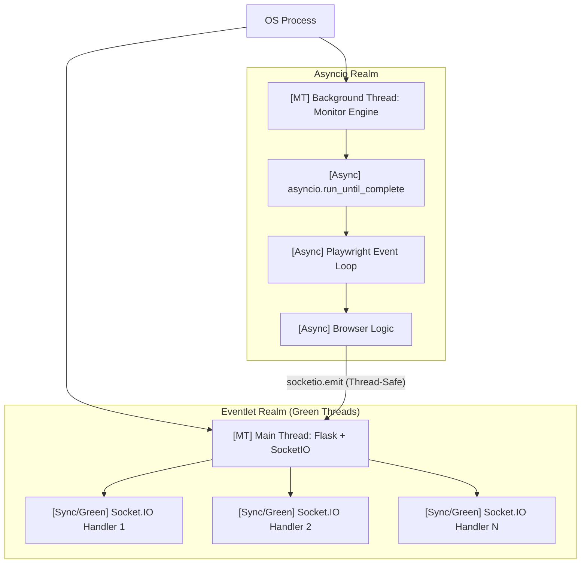

# PC-Monitor-Microservice: Concurrency Architecture Analysis

This document provides a senior-level technical breakdown of the concurrency mechanisms used in `pokemon_monitor.py`. The system uses a hybrid model combining **Green Threads (Eventlet)**, **OS Threads**, and **Asynchronous I/O (Asyncio)**.

## 1. High-Level Concurrency Model

The application operates on two primary concurrent planes:
1.  **The Web Dashboard (Main Loop)**: Handles HTTP requests and Socket.IO connections.
2.  **The Monitor Engine (Background Worker)**: Executes the browser-based scraping logic.

---

## 2. Component Analysis (Sync vs Async vs Threading)

### A. `eventlet.monkey_patch()` (The Foundation) [Synchronous]
**Mechanism**: Synchronous blocking replacement.
At the very first line, `eventlet` replaces standard Python libraries (like `socket`, `select`, `threading`) with versions that "yield" control to the Eventlet hub when they would normally block for I/O.
*   **Type**: **Synchronous Bootstrap**.
*   **Impact**: This allows the Flask server to handle thousands of dashboard users simultaneously without needing thousands of heavy OS threads.
*   **Why?**: Crucial for Railway's lightweight containers where spawning 1000s of OS threads would lead to memory crashes.

### B. `socketio.run(app, async_mode='eventlet')` [Multithreaded / Green Threads]
**Mechanism**: Green Thread scheduling (Cooperative Multitasking).
This call starts the main execution loop. Because `async_mode='eventlet'` is set, Socket.IO uses a non-blocking engine. 
*   **Type**: **Multithreading (Virtual/Green)**.
*   **Detail**: Each incoming browser connection creates a new "Green Thread". This is technically synchronous code running within a cooperative multitasker managed by Eventlet. It mimics multithreading but stays within a single OS process to save memory.

### C. `threading.Thread(target=run_monitor, daemon=True)` [Multithreaded / OS Thread]
**Mechanism**: OS Thread spawning (Preemptive Multitasking).
*   **Type**: **Multithreading (OS Level)**.
*   **Detail**: We spawn one dedicated background thread for the monitor. Even though `eventlet` is active, we use a separate thread to ensure the heavy logic work of the monitor doesn't starve the web server of execution time. This ensures that if the browser hangs, the dashboard stays alive.

### D. `monitor_loop()` (Asyncio + Playwright) [Asynchronous]
**Mechanism**: Single-threaded Event Loop (Asynchronous I/O).
Inside the background thread, we start a *private* `asyncio` event loop via `asyncio.run_until_complete`.
*   **Type**: **Asynchronous (Asyncio)**.
*   **Detail**: Playwright requires an async environment to manage the browser's Chromium processes.
    - **`await page.goto()`**: Suspends the monitor loop while the page loads, allowing the loop to handle internal events.
    - **`await update_supabase_state()`**: Uses `httpx.AsyncClient` to update the database without stopping the script.

### E. Data Synchronization & Communication [Thread-Safe Sync]
**Mechanism**: Cross-thread safe emission.
*   **`socketio.emit`**: **Thread-Safe Synchronous Call**. When called from the background `monitor_loop`, it pushes data into a queue that the main Eventlet loop processes and sends to users' browsers.
*   **Global Variables**: `monitor_stats` and `last_screenshot` are shared. Since the monitor only *writes* and the dashboard only *reads* these, we avoid complex locking.

### F. Business & Scheduling Logic [Synchronous]
- **`calculate_next_sleep()`**: **Synchronous**. Pure mathematical logic executed inside the async loop. It provides immediate results without any I/O wait.
- **`detect_queue()` / `detect_block()`**: **Hybrid**. They analyze page content (Async fetch) and then perform complex string matching and regex logic (Sync execution).

---

## 3. Concurrency Tagging Guide (Function Audit)

| Function / Part | Concurrency Tag | Why? |
| :--- | :--- | :--- |
| `fire_push_notifications` | **Async** | Uses `httpx` to send network requests without blocking the scraper. |
| `simulate_human_behavior` | **Async** | Uses `await asyncio.sleep()` for non-blocking human-like delays. |
| `calculate_next_sleep` | **Sync** | Pure math calculation; finishes in microseconds. |
| `log_to_dashboard` | **Thread-Safe Sync** | Pushes data from the background worker thread to the front-end queue. |
| `monitor_loop` | **Async Engine** | Orchestrates the entire scraping lifecycle using Playwright's async API. |
| `socketio.run` | **Blocking Main** | The permanent loop that keeps the Flask server alive. |
| `detect_queue` | **Async/Sync Hybrid** | Awaits browser data, then runs scoring logic synchronously. |

---

## 4. Why this is "Railway-Ready"
By using `eventlet`, the program is highly memory-efficient. If you hit 100% CPU on Railway, the web dashboard will still remain responsive because Eventlet will "slice" time between the scraping work and the web traffic. The addition of `--disable-dev-shm-usage` ensures that the **Asyncio** side doesn't crash the container when memory gets tight.

---

## 5. Error Recovery & Lifecycle
- **The Crash Guard**: When an exception occurs in the `monitor_loop`, the `except` block runs synchronously, closes any orphan pages/browsers, and then `await asyncio.sleep(60)` is called. This "yields" the thread back to the scheduler, ensuring the error doesn't cause a CPU spike.
- **The Cleanup Cycle**: By moving `async with async_playwright()` inside the `while True` loop, we've implemented a "Flush" mechanism. On every successful check or proxy rotation, the entire Playwright driver is destroyed and recreated. This is the ultimate defense against memory leaks in long-running scrapers.
